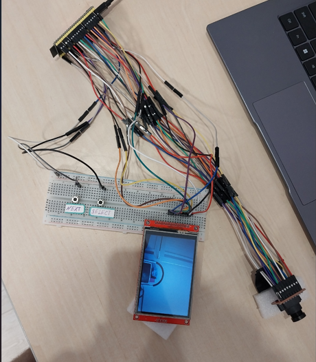
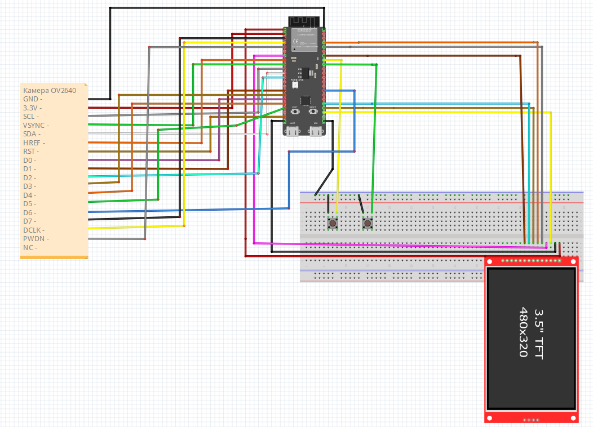
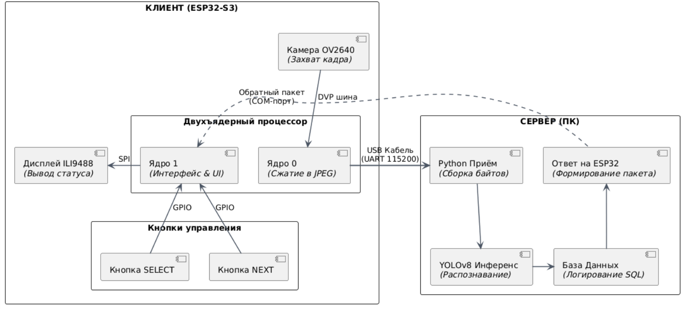
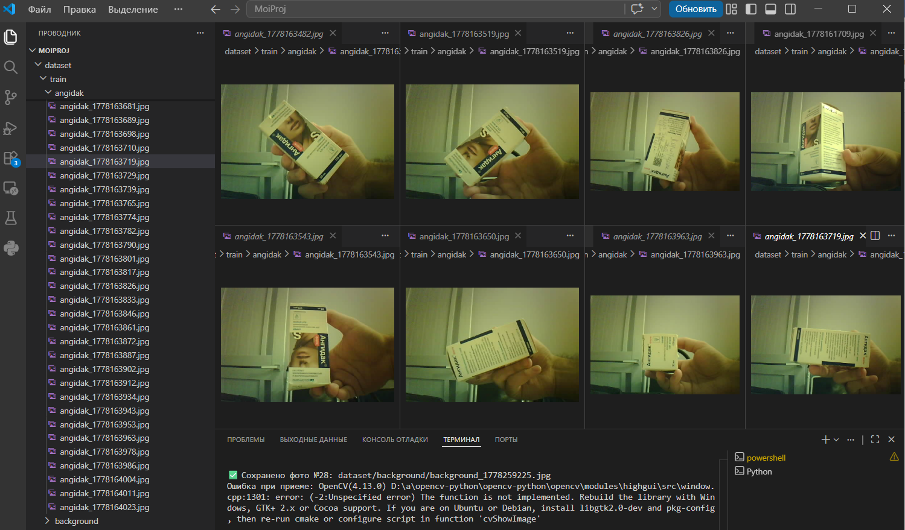
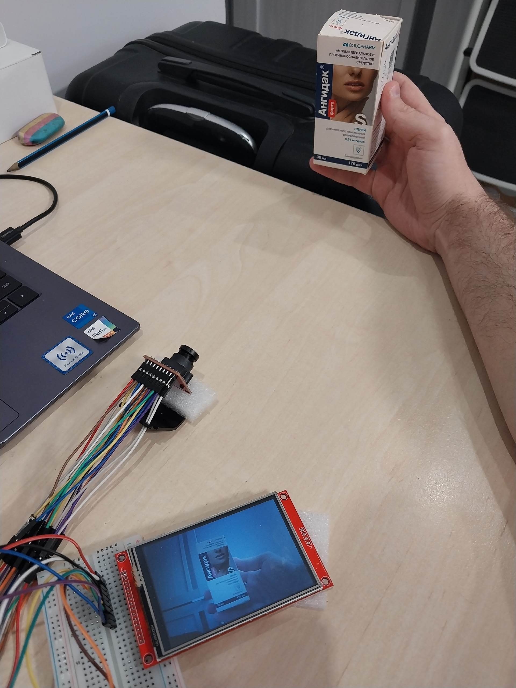
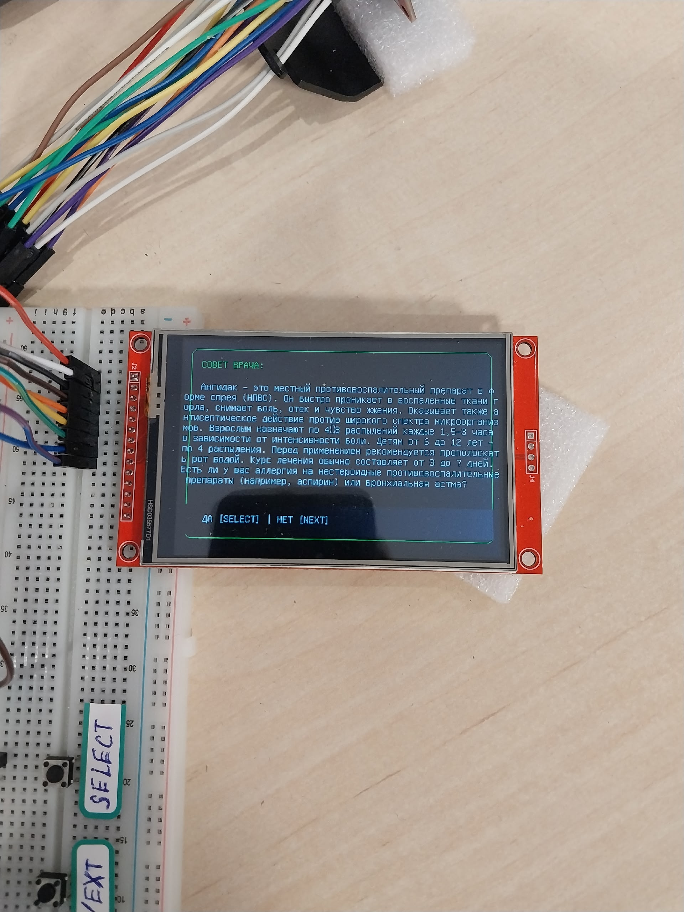
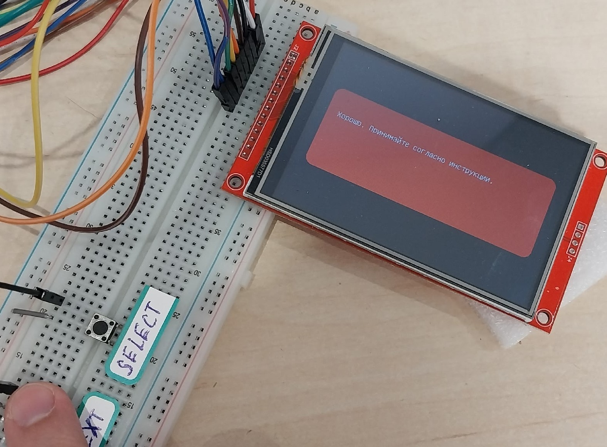
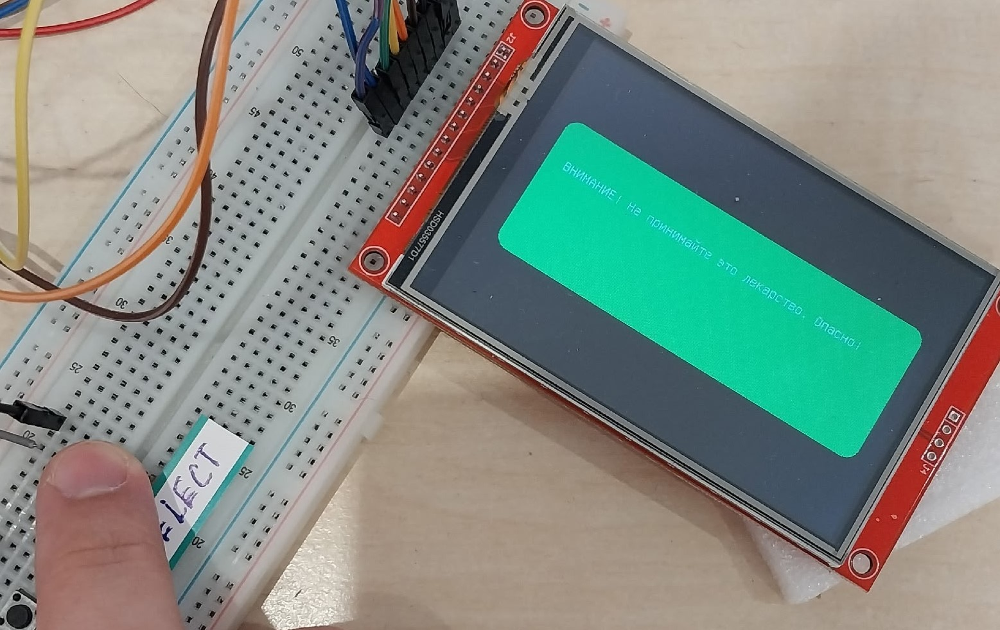
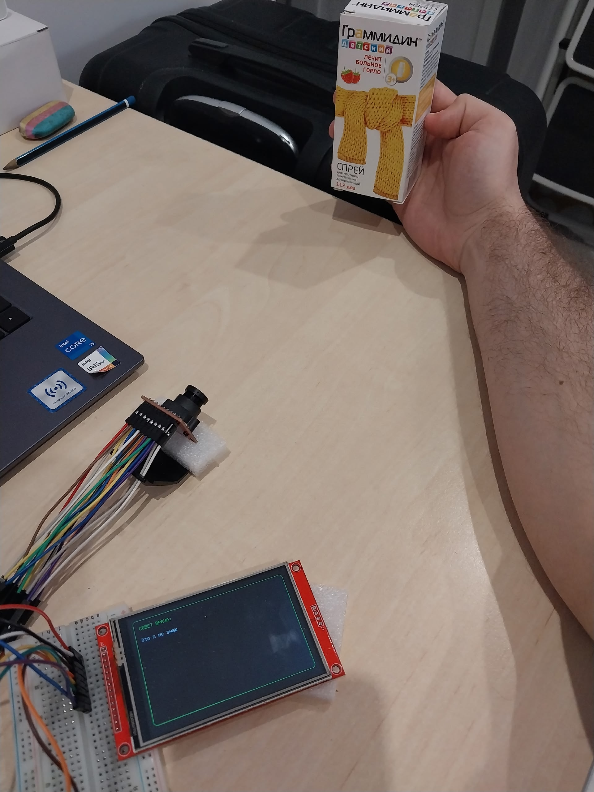

<div align="center">

# Smart Medicine Recognizer

**Портативное устройство для распознавания лекарств на базе ESP32-S3 и YOLOv8**

[](https://www.espressif.com/)
[](https://github.com/ultralytics/ultralytics)
[](https://www.python.org/)
[](https://www.arduino.cc/)
[](LICENSE)

</div>

---

## 📖 О проекте

Портативный прибор, который помогает пожилым людям и пациентам с ослабленным зрением правильно идентифицировать лекарства. Наводите камеру на упаковку — устройство распознаёт препарат и выводит инструкцию на экран крупным шрифтом.

> **Главная идея:** искусственный интеллект работает как информационный ассистент, а не как замена врачу. При низкой уверенности система честно сообщает об этом вместо того, чтобы давать ложный совет.

<p align="center">
  
</p>

---

## ✨ Возможности

| | Возможность | Описание |
|---|-------------|----------|
| 📷 | **Распознавание** | YOLOv8n-cls определяет препарат по фото упаковки |
| 🖥️ | **Вывод информации** | TFT-дисплей 3.5" (480×320) с поддержкой кириллицы |
| 🔘 | **Интерактивный диалог** | Уточняющие вопросы через физические кнопки ДА / НЕТ |
| 🛡️ | **Защита от ошибок** | Порог уверенности 0.85 отсекает ложные срабатывания |
| 💰 | **Доступность** | Себестоимость ~1500 рублей |

---

## 🛠 Аппаратное обеспечение

| Компонент | Модель | Назначение |
|-----------|--------|------------|
| 🧠 Микроконтроллер | ESP32-S3 N16R8 | 16MB Flash, 8MB PSRAM, 240 МГц, 2 ядра |
| 📷 Камера | OV2640 | DVP интерфейс, 2 МП |
| 🖥️ Дисплей | ILI9488 | 3.5" TFT, 480×320, SPI |
| 🔘 Кнопки | Тактовые | GPIO 40 (SELECT), GPIO 39 (NEXT) |

### 📐 Схема подключения

<p align="center">
  
</p>

---

## 💻 Программное обеспечение

### 🏗 Архитектура

Устройство разделено на две части: **клиент** (ESP32-S3) и **сервер** (ПК на Python). Общение — через USB-Serial на скорости 115200 бод.

<p align="center">
  
</p>

> **❓ Почему не всё на микроконтроллере?**
> ESP32-S3 физически не может запустить YOLOv8 в реальном времени — инференс занимал **2.5 секунды**, интерфейс зависал. Поэтому тяжёлые вычисления вынесены на ПК, а микроконтроллер отвечает только за захват кадра и вывод на экран.

### 🧰 Стек технологий

**Клиент (ESP32-S3):**
- C++ / Arduino IDE
- FreeRTOS (двухъядерная обработка)
- LovyanGFX (графика через DMA)
- esp_camera (драйвер OV2640)

**Сервер (Python):**
- Python 3.10+
- Ultralytics YOLOv8 (классификация)
- OpenCV (декодирование JPEG)
- PySerial (приём по COM-порту)

**Модель:**
- YOLOv8n-cls (6 МБ)
- Обучена на 340 фото в Google Colab (Tesla T4)

---

## 📸 Датасет

Для обучения модели был собран собственный датасет из **340 фотографий** трёх препаратов и класса «фон». Съёмка велась при разном освещении (500, 100 и 10 люкс), с разных углов и на разных фонах.

<p align="center">
  
</p>

| Класс | Train | Val | Всего |
|-------|:-----:|:---:|:-----:|
| 💊 Ангидак (angidak) | 47 | 47 | **94** |
| 💊 Эргоферон (ergoferon) | 46 | 46 | **92** |
| 💊 Мирамистин (miramistin) | 47 | 47 | **94** |
| 🚫 Фон (background) | 30 | 30 | **60** |
| **Итого** | **170** | **170** | **340** |

---

## 🚀 Быстрый старт

### 1️⃣ Сервер (Python)

```bash
git clone https://github.com/Trouble-3/medical-iot-esp32.git
cd medical-iot-esp32

pip install ultralytics opencv-python pyserial numpy

python server/server_yolo.py
```

> ⚠️ Убедитесь, что в `server/server_yolo.py` указан правильный COM-порт (например, `COM6`).

### 2️⃣ Прошивка ESP32-S3

1. Откройте `firmware/MedicaESP32.ino` в Arduino IDE
2. Установите библиотеки: `LovyanGFX`, `esp32-camera`
3. Выберите плату: `ESP32S3 Dev Module`
4. Включите PSRAM: `Tools → PSRAM → OPI PSRAM`
5. Укажите пины для камеры и дисплея (см. схему)
6. Прошейте устройство

---

## 📊 Результаты тестирования

### 🎯 Точность распознавания

| Класс (препарат) | Правильно | Ошибок | Точность |
|------------------|:---------:|:------:|:--------:|
| Ангидак | 46 из 47 | 1 | **97.9%** |
| Эргоферон | 44 из 46 | 2 | **95.7%** |
| Мирамистин | 46 из 47 | 1 | **97.9%** |
| Фон (нет лекарства) | 29 из 30 | 1 | **96.7%** |
| **Среднее** | **165 из 170** | **5** | **97.1%** |

### 💡 Влияние освещения

| Освещение | Точность | Статус |
|-----------|:--------:|:------:|
| ☀️ Дневной свет (500 лк) | **97%** | ✅ Отлично |
| 💡 Лампа накаливания (100 лк) | **93%** | ✅ Приемлемо |
| 🌙 Сумерки (10 лк) | **75%** | ⚠️ Ниже нормы |

> **Вывод:** при дневном свете система работает отлично, при лампе — приемлемо, в сумерках — рекомендуется включить свет.

### ⏱ Производительность

| Этап | Время | Доля |
|------|:-----:|:----:|
| Захват кадра | 150 мс | 12.5% |
| Отправка по Serial | 500 мс | **41.7%** ⬅️ узкое место |
| Инференс YOLOv8 | 100 мс | 8.3% |
| Вывод на дисплей | 200 мс | 16.7% |
| Прочее | 250 мс | 20.8% |
| **Итого** | **1200 мс** | **100%** |

> 🐢 **Узкое место** — передача по Serial (0.5 секунды). Если поднять скорость до 921600 бод, время сократится до 0.8 сек, но вырастет риск потери байтов.

### ❌ Анализ ошибок

| № | Класс | Предсказание | Причина |
|:-:|-------|--------------|---------|
| 1 | Эргоферон | Фон | Сильный блик, текст не читался |
| 2 | Эргоферон | Ангидак | Похожий размер и форма коробки |
| 3 | Ангидак | Эргоферон | Тень закрыла часть зелёного элемента |
| 4 | Мирамистин | Фон | Флакон прозрачный, слился со столом |
| 5 | Фон | Ангидак | Красная книга принята за упаковку |

---

## 🎬 Демонстрация работы

### 🔍 Процесс распознавания

Пользователь наводит камеру на упаковку лекарства и нажимает кнопку **SELECT**. Устройство захватывает кадр, отправляет его на сервер, а через секунду выводит результат на экран.

<p align="center">
  
</p>

### 💬 Интерактивный диалог

После распознавания устройство задаёт уточняющий вопрос о противопоказаниях. Пользователь отвечает кнопками **ДА [SELECT]** или **НЕТ [NEXT]**.

<p align="center">
  
</p>

### ✅ Результат: безопасно

Если противопоказаний нет — система выводит зелёное подтверждение: **«Хорошо. Принимайте согласно инструкции.»**

<p align="center">
  
</p>

### ⚠️ Результат: внимание

Если пользователь сообщил о возможных противопоказаниях — система выдаёт красное предупреждение: **«ВНИМАНИЕ! Не принимайте это лекарство. Опасно!»**

<p align="center">
  
</p>

### ❓ Результат: не знаю

Если уверенность модели ниже порога **0.85**, система честно сообщает: **«Это я не знаю»** — вместо ложного совета. Это ключевое требование безопасности.

<p align="center">
  
</p>

> **🛡 Почему это важно?** В медицинских приложениях ложный отказ всегда предпочтительнее неверной рекомендации. Система работает по принципу **«не навреди»**.

---

## 🧪 Детали экспериментов

### 1. Сбор датасета

Был написан специальный скрипт `photo.py`, работающий в паре с ESP32. Пользователь нажимает кнопку SELECT на устройстве — ESP32 захватывает кадр в формате JPEG, отправляет по Serial команду `START_IMAGE`, затем размер файла и сами байты. Скрипт на Python принимает данные, декодирует JPEG через OpenCV и сохраняет файл. Ключевая особенность — автоматическое создание временных меток в именах файлов.

#### Условия съёмки

| Режим | Освещение | Условия |
|-------|-----------|---------|
| Режим 1 | Дневной свет (500 люкс) | Съёмка у окна в ясный день. Солнечный свет падал под углом 45 градусов. |
| Режим 2 | Лампа накаливания (100 люкс) | Вечером при включённой настольной лампе мощностью 60 Вт. |
| Режим 3 | Сумерки (10 люкс) | При выключенном верхнем свете, только подсветка от экрана монитора. |

Расстояние от камеры до упаковки менялось от 15 до 30 сантиметров. Угол наклона варьировался от 0 до 20 градусов. Фон был различным: белый стол, деревянная книга, серая ткань.

#### Структура датасета

```
dataset/
├── train/
│   ├── angidak/
│   ├── background/
│   ├── ergoferon/
│   └── miramistin/
└── val/
    ├── angidak/
    ├── background/
    ├── ergoferon/
    └── miramistin/
```

Разделение на обучающую и валидационную выборки выполнено в пропорции **50 на 50**, что обусловлено малым объёмом данных. Класс `background` необходим для того, чтобы модель могла уверенно отвечать «не знаю», когда в кадре нет лекарства.

### 2. Обучение модели

Использовался Google Colab с бесплатным GPU. Параметры обучения:
- Эпох: **50**
- Размер входного изображения: **480×480** пикселей
- Датасет: 170 изображений в train, 170 в val

```python
from ultralytics import YOLO

model = YOLO('yolov8n-cls.pt')
model.train(data='/content/dataset', epochs=50, imgsz=480)
```

**Результаты:**
- `metrics/accuracy_top1`: **1.0** (100%)
- `metrics/accuracy_top5`: **1.0**
- Время инференса: **55 мс** на CPU
- Размер файла модели: **2.9 МБ**

### 3. Выявленные проблемы при тестировании

**Проблема 1. OpenCV не показывал окно предпросмотра.**

Ошибка: `The function is not implemented. Rebuild the library with Windows, GTK+ 2.x or Cocoa support`.

Причина: Python установлен через менеджер пакетов Scoop, который собрал OpenCV без поддержки GUI.

Решение: из кода удалены функции `cv2.imshow()` и `cv2.waitKey()`. Они не критичны, так как распознавание происходит в фоновом режиме.

**Проблема 2. При первом запуске сервер не мог открыть COM6.**

Ошибка: «Не удалось открыть порт».

Причина: был открыт Serial Monitor в Arduino IDE, который заблокировал порт.

Решение: закрыть монитор порта перед запуском Python-скрипта.

### 4. Анализ производительности

| Этап | Время, мс | Доля от общего |
|------|-----------|----------------|
| Захват кадра ESP32 | 150 | 12.5% |
| Отправка по Serial (115200 бод) | 500 | 41.7% |
| Инференс YOLOv8n-cls на Intel i5 | 100 | 8.3% |
| Отправка ответа | 50 | 4.2% |
| Отрисовка на дисплее | 200 | 16.7% |
| Задержки и обработка | 200 | 16.7% |
| **Общее время** | **1200** | **100%** |

**Узкое место.** Передача по Serial занимает 0.5 секунды — половину всего времени. JPEG-кадр объёмом 25 КБ требует около 0.22 секунды чистой передачи, но с учётом накладных расходов драйвера и буферизации время достигает 0.5 секунды.

**Как ускорить?** При повышении скорости до 921600 бод (максимум для чипа CH340) время передачи сократится до 0.07 секунды, а общее время упадёт до 0.8 секунды. Однако повышение скорости не применялось — на 115200 бод связь надёжнее и потери байтов отсутствуют.

### 5. Анализ точности по освещению

| Освещение | angidak | ergoferon | miramistin | background | Среднее |
|-----------|:-------:|:---------:|:----------:|:----------:|:-------:|
| 500 люкс (дневной свет) | 97.9% | 95.7% | 97.9% | 96.7% | **97.1%** |
| 100 люкс (лампа) | 93.6% | 91.3% | 93.6% | 93.3% | **93.0%** |
| 10 люкс (сумерки) | 76.6% | 72.0% | 70.2% | 83.3% | **75.5%** |

**Выводы.** При дневном свете система работает отлично — 97%. При освещении лампой точность падает до 93%, что всё ещё приемлемо. В сумерках точность падает до 75% — это ниже безопасного порога. Пользователю рекомендуется включать свет перед использованием.

### 6. Анализ качества интерфейса

**Сильные стороны:**
- Шрифт крупный (16 пикселей), читается с расстояния вытянутой руки.
- Цветовая кодировка: зелёный — информация, красный — предупреждение, синий — загрузка.
- Кнопки подсвечены, пользователь всегда видит, куда нажимать.

**Слабые стороны:**
- Текст в некоторых карточках обрезается (экран 480×320).
- Белая подложка под шрифтом иногда сливается с фоном.

**Планируемые улучшения:**
- Увеличение высоты карточки и добавление прокрутки.
- Анимированный индикатор загрузки (прогресс-бар).
- Звуковое сопровождение (писк при появлении вопроса).

---

## 📊 Итоговые результаты

| Параметр | Значение |
|----------|----------|
| Точность (дневной свет) | 96-97% |
| Точность (лампа) | 93% |
| Точность (сумерки) | 75% |
| Скорость отклика | 1.2 сек |
| Себестоимость | ~1500 руб. |
| Время автономной работы | до месяца |

---

## 📁 Структура проекта

```
medical-iot-esp32/
├── firmware/                    # Прошивка ESP32-S3 (C++)
│   └── MedicaESP32.ino
├── server/                      # Python-сервер
│   ├── server_yolo.py           # Основной скрипт распознавания
│   └── photo.py                 # Скрипт сбора датасета
├── model/                       # Обученная модель
│   └── best.pt                  # YOLOv8n-cls (2.9 МБ)
├── dataset/                     # Датасет (340 фото)
│   └── dataset.zip
├── docs/                        # Документация и изображения
│   ├── schema.png               # Схема подключения
│   ├── schema2.png              # Фото устройства
│   ├── schema3.png              # Архитектурная диаграмма
│   ├── naprimer.png             # Примеры из датасета
│   └── rezulta*.jpg             # Демонстрация работы
└── README.md
```
---
---

## 📄 Лицензия

Этот проект распространяется под лицензией **MIT**. Свободно для использования, модификации и распространения.

---

## 📚 Ссылки

- [Ultralytics YOLOv8](https://github.com/ultralytics/ultralytics) — фреймворк для обучения
- [LovyanGFX](https://github.com/lovyan03/LovyanGFX) — быстрая графика для ESP32
- [Espressif ESP32-S3](https://www.espressif.com/en/products/socs/esp32-s3) — документация чипа

<div align="center">

**⭐ Если проект вам понравился — поставьте звезду!**

</div>
